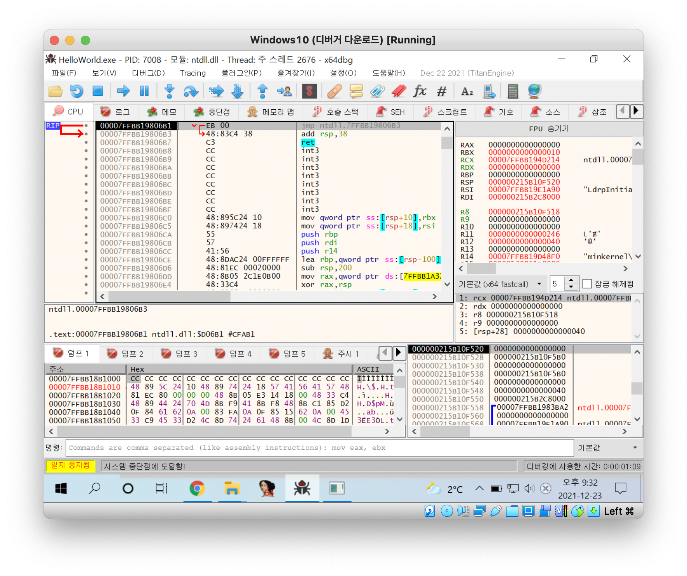

## Hello World! 프로그램

### 디버거와 어셈블리 언어
- 개발 도구를 이용해 C언어 소스 코드( *.cpp)를 빌드하면, 실행 파일( *.exe)이 생성됩니다.
- 사람이 이해하기 쉬운 C언어 소스 코드를 기계가 이해하기 쉬운 기계어( *.exe)로 변환하는 과정입니다.
- 이렇게 변환된 기계어는 사람이 알아보기 어렵기 때문에 좀 더 편하게 보기 위해서 디버거(Debugger) 유틸리티를 사용합니다.
- 디버거에 탑재된 디스어셈블러(Disassembler) 모듈은 이 기계어를 어셈블리(Assembly) 언어로 번역하여 보여줍니다.
- 어셈블리 언어는 CPU에 종속되어 있습니다. **일반 PC에서 많이 사용되는 Intel x86 계열의 CPU와 모바일 제품에서 많이 사용되는 ARM 계열의 CPU는 서로 어셈블리 명령어의 형태가 다릅니다.**

## HelloWorld.exe 디버깅

### 디버깅 목표
```HelloWorld.exe 실행 파일을 디버깅(Debugging)하여 어셈블리 언어로 변환된 main() 함수를 찾아 기본적인 디버거의 사용법과 어셈블리 명령어에 대한 공부```

### 디버깅 시작
- HelloWorld.exe 파일을 디버거 ```x64dbg```로 열어줍니다.

```본 문에서는 32bit OS를 이용하여 OllyDbg 프로그램을 사용하였지만, 64bit OS에서는 실행이 안되는 부분으로 x64dbg 프로그램을 사용하여 실습합니다.```


- 리버서들은 일반적으로 파일을 분석할 때 소스코드가 없이 실행 파일만 가지고 분석을 하기 때문에 전문 디버거를 사용합니다.

**메인 화면 구성**
<table>
<tr><th>Code Window</th><td>기본적으로 disassembly code를 표시하여 각종 comment, label을 보여주며, 코드를 분석하여 loop, jump 위치 등의 정보를 표시합니다.</td></tr>
<tr><th>Register Window</th><td>CPU register 값을 실시간으로 표시하며 특정 register들은 수정도 가능합니다.</td></tr>
<tr><th>Dump Window</th><td>프로세스에서 원하는 memory 주소 위치를 Hex와 ASCII/유니코드 값으로 표시하고 수정도 가능합니다.</td></tr>
<tr><th>Stack Window</th><td>ESP register가 가리키는 프로세스 stack memory를 실시간으로 표시하고 수정도 가능합니다.</td></tr>
</table>

### EP
**EP(EntryPoint)란 Windows 실행 파일(EXE, DLL, SYS 등)의 코드 시작점을 의미합니다. 프로그램이 실행될 때 CPU에 의해 가장 먼저 실행되는 코드 시작 위치입니다.**

```책의 32bit OS를 예시로 들겠습니다.```
- 디버거가 멈춘 곳은 EP(EntryPoint) 코드로, HelloWorld.exe의 실행 시작 주소(4011A0)입니다.
- EP 코드에 눈에 띄는 것은 CALL 명령과 JMP 명령입니다.

<table>
<tr><th>Address</th><th>Instruction</th><th>Disassembled code</th><th>comment</th></tr>
<tr><td>004011A0</td><td>E8 67150000</td><td>CALL 0040270C</td><td>0040270C (40270C 주소의 함수를 호출)</td></tr>
<tr><td>004011A5</td><td>E9 A5FEFFFF</td><td>JMP 0040104F</td><td>0040104F (0040104F 주소로 점프)</td></tr>
</table>

<table>
<tr><th>Address</th><td>프로세스의 가상 메모리(Virtual Address:VA) 내의 주소</td></tr>
<tr><th>Instruction</th><td>IA32(or x86) CPU 명령어</td></tr>
<tr><th>Disassembled code</th><td>OP code를 보기 쉽게 어셈블리로 변환한 코드</td></tr>
<tr><th>comment</th><td>디버거에서 추가한 주석(옵션에 따라 약간씩 다르게 보입니다.)</td></tr>
</table>

- 위 두 줄의 어셈블리 코드의 의미는 명확하게 알 수 있습니다.
"```40270C 주소의 함수를 호출(CALL)한 후 40104F 주소로 점프(JMP)하라```"


