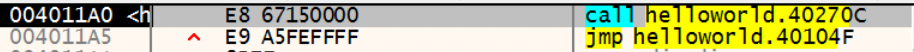
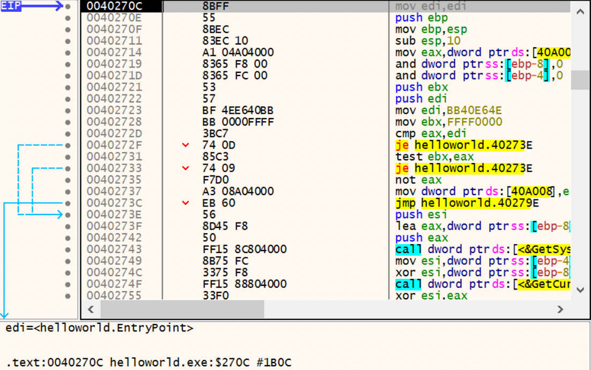
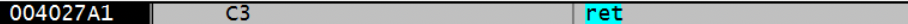
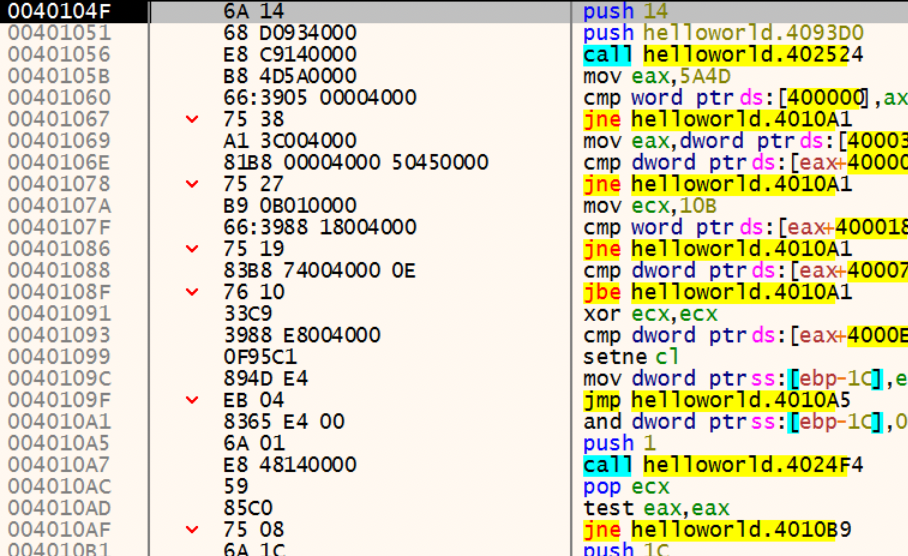
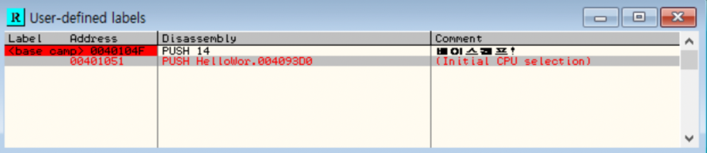

## Hello World! 프로그램

### 디버거와 어셈블리 언어
- 개발 도구를 이용해 C언어 소스 코드( *.cpp)를 빌드하면, 실행 파일( *.exe)이 생성됩니다.
- 사람이 이해하기 쉬운 C언어 소스 코드를 기계가 이해하기 쉬운 기계어( *.exe)로 변환하는 과정입니다.
- 이렇게 변환된 기계어는 사람이 알아보기 어렵기 때문에 좀 더 편하게 보기 위해서 디버거(Debugger) 유틸리티를 사용합니다.
- 디버거에 탑재된 디스어셈블러(Disassembler) 모듈은 이 기계어를 어셈블리(Assembly) 언어로 번역하여 보여줍니다.
- 어셈블리 언어는 CPU에 종속되어 있습니다. **일반 PC에서 많이 사용되는 Intel x86 계열의 CPU와 모바일 제품에서 많이 사용되는 ARM 계열의 CPU는 서로 어셈블리 명령어의 형태가 다릅니다.**

## HelloWorld.exe 디버깅

### 디버깅 목표
```HelloWorld.exe 실행 파일을 디버깅(Debugging)하여 어셈블리 언어로 변환된 main() 함수를 찾아 기본적인 디버거의 사용법과 어셈블리 명령어에 대한 공부```

### 디버깅 시작
- HelloWorld.exe 파일을 디버거 ```x32dbg```로 열어줍니다.

```본 문에서는 32bit OS를 이용하여 OllyDbg 프로그램을 사용하였지만, 64bit OS에서는 실행이 되지 않기 때문에 x32dbg 프로그램에 예제 파일을 사용하여 실습합니다.```


- 리버서들은 일반적으로 파일을 분석할 때 소스코드가 없이 실행 파일만 가지고 분석을 하기 때문에 전문 디버거를 사용합니다.

**메인 화면 구성**
<table>
<tr><th>Code Window</th><td>기본적으로 disassembly code를 표시하여 각종 comment, label을 보여주며, 코드를 분석하여 loop, jump 위치 등의 정보를 표시합니다.</td></tr>
<tr><th>Register Window</th><td>CPU register 값을 실시간으로 표시하며 특정 register들은 수정도 가능합니다.</td></tr>
<tr><th>Dump Window</th><td>프로세스에서 원하는 memory 주소 위치를 Hex와 ASCII/유니코드 값으로 표시하고 수정도 가능합니다.</td></tr>
<tr><th>Stack Window</th><td>ESP register가 가리키는 프로세스 stack memory를 실시간으로 표시하고 수정도 가능합니다.</td></tr>
</table>

### EP
**EP(EntryPoint)란 Windows 실행 파일(EXE, DLL, SYS 등)의 코드 시작점을 의미합니다. 프로그램이 실행될 때 CPU에 의해 가장 먼저 실행되는 코드 시작 위치입니다.**

```책의 32bit OS를 예시로 들겠습니다.```
- 디버거가 멈춘 곳은 EP(EntryPoint) 코드로, HelloWorld.exe의 실행 시작 주소(4011A0)입니다.
- EP 코드에 눈에 띄는 것은 CALL 명령과 JMP 명령입니다.



<table>
<tr><th>Address</th><th>Instruction</th><th>Disassembled code</th><th>comment</th></tr>
<tr><td>004011A0</td><td>E8 67150000</td><td>CALL 0040270C</td><td>0040270C (40270C 주소의 함수를 호출)</td></tr>
<tr><td>004011A5</td><td>E9 A5FEFFFF</td><td>JMP 0040104F</td><td>0040104F (0040104F 주소로 점프)</td></tr>
</table>

<table>
<tr><th>Address</th><td>프로세스의 가상 메모리(Virtual Address:VA) 내의 주소</td></tr>
<tr><th>Instruction</th><td>IA32(or x86) CPU 명령어</td></tr>
<tr><th>Disassembled code</th><td>OP code를 보기 쉽게 어셈블리로 변환한 코드</td></tr>
<tr><th>comment</th><td>디버거에서 추가한 주석(옵션에 따라 약간씩 다르게 보입니다.)</td></tr>
</table>

- 위 두 줄의 어셈블리 코드의 의미는 명확하게 알 수 있습니다.
"```40270C 주소의 함수를 호출(CALL)한 후 40104F 주소로 점프(JMP)하라```"

### 40270C 함수 따라가기
- x32dbg/x64dbg의 기본 명령어 사용법
<table>
<tr><th>명령어</th><th>단축키</th><th>설명</th></tr>
<tr><td>Restart</td><td>[Ctrl+F2]</td><td>다시 처음부터 디버깅 시작(디버깅을 당하는 프로세스를 종료하고 재실행)</td></tr>
<tr><td>Step Into</td><td>[F7]</td><td>하나의 OP code 실행(CALL 명령을 만나면, 그 함수 코드 내부로 따라 들어감)</td></tr>
<tr><td>Step Over</td><td>[F8]</td><td>하나의 OP code 실행(CALL 명령을 만나면, 따라 들어가지 않고 그냥 함수 자체를 실행)</td></tr>
<tr><td>Execute till Return</td><td>[Ctrl+F9]</td><td>함수 코드 내에서 RET 명령어까지 실행(함수 탈출 목적)</td></tr>
</table>

- EP 코드의 4011A0 주소에서 ```Step Into[F7]``` 명령어를 이용해 40270C 함수 안으로 따라갈 수 있습니다.



- Code Window의 가장 오른쪽 부분은 주석(Comment)입니다. 그 중 빨간색 글씨로 된 부분은 코드에서 호출되는 API 함수 이름인데, **원본 소스코드에서 사용된적 없는 API들이 호출되고 있기 때문에 main() 함수가 아닌 것을 알 수 있습니다.**
- 이는 프로그램 실행을 위해서 자동으로 추가되는 Stub Code입니다.

<br/>

- 4027A1 주소에 RET 명령어가 존재합니다.
- RET은 함수 끝에서 사용되며 이 함수가 호출된 원래 주소 쪽으로 되돌아갑니다.
- RET 명령어까지 한 번에 가는 단축키는 ```Execute till Return[Ctrl+F9]``` 입니다.



### 40104F 점프문 따라가기
- 4011A5 주소의 JMP 0040104F 명령을 실행하여 40104F 주소로 갑니다.



- 컴파일러의 Stub Code가 나오는데, 이 코드를 따라가다보면 main() 함수를 찾을 수 있습니다.
- Visual C++로 제작된 실행 파일들은 이런 형식으로 되어 있습니다. **Stub Code는 개발 도구에 따라 달라지기 때문에** 많이 접해보는 것이 좋습니다. 

### main() 함수 찾기
- 40104F 주소부터 함수 호출 명령어를 따라가다보면 main() 함수를 만날 수 있습니다.


[F7] 명령으로 한 줄씩 내려오다보면 401056 주소의 CALL 402524 함수 호출 명령어를 만납니다.
마찬가지로 [F7] 명령을 통해 함수 내부로 들어가봅니다.

하지만 main() 함수라 보기에는 어려운 것을 알 수 있습니다. ```MessageBox() API 호출 코드```가 보이지 않기 때문입니다.
[Ctrl+F9] 명령어를 사용하여 RETN 명령어 위치까지 디버깅을 진행하고, [F7] 또는 [F8] 명령을 통해 402524 함수를 탈출합니다.

위와 같은 방식으로 내려가면서 함수 호출을 만나면 함수 내부로 들어가보고 main() 함수가 아니라면 해당 함수를 탈출해 디버깅을 진행합니다. (함수 내부에 반복문이 존재하면 함수 탈출을 진행할 때 시간이 오래걸릴 수 있습니다.)

디버깅을 하며 내려가다보면 401144 주소의 CALL 401000 명령어를 확인할 수 있습니다. [F7] 명령으로 함수 내부로 들어갑니다. 
```MessageBoxW() API를 호출하는 코드```와 함께 API의 파라미터인 ```"www.reversecore.com"과 "Hello World!"``` 문자열이 확인됩니다.

.png)


이 코드와 문자열은 HelloWorld.cpp의 소스코드 내용과 일치하기 때문에 **401000 함수가 main() 함수**입니다.

## 디버거 다양하게 다루기
### 디버거 명령어
추가적인 디버깅 명령어 사용 방법입니다.
<table>
<tr><th>명령어</th><th>단축키</th><th>설명</th></tr>
<tr><td>Go to</td><td>Ctrl+G</td><td>원하는 주소로 이동(코드/메모리를 확인할 때 사용. 실행되는 것은 아님)</td></tr>
<tr><td>Execute till Cursor</td><td>F4</td><td>cursor 위치까지 실행(디버깅하고 싶은 주소까지 바로 갈 수 있음)</td></tr>
<tr><td>Comment</td><td>;</td><td>Comment 추가</td></tr>
<tr><td>User-defined comment</td><td></td><td>마우스 우측 메뉴 Search for User-defined comment</td></tr>
<tr><td>Label</td><td>:</td><td>Label 추가</td></tr>
<tr><td>User-defined label</td><td></td><td>마우스 우측 메뉴 Search for User-defined label</td></tr>
<tr><td>Set/Reset BreakPoint</td><td>F2</td><td>BP 설정/해제</td></tr>
<tr><td>Run</td><td>F9</td><td>실행(BP가 걸려있으면 그 곳에서 실행이 정지됨)</td></tr>
<tr><td>Show the current EIP</td><td>*</td><td>현재 EIP 위치를 보여줍니다.</td></tr>
<tr><td>Show the previous Cursor</td><td>-</td><td>직전 커서 위치를 다시 보여줍니다.</td></tr>
<tr><td>Preview CALL/JMP address</td><td>Enter</td><td>커서가 CALL/JMP 등의 명령어에 위치해 있다면, 해당 주소를 따라가서 보여줌(실행되는 것이 아님. 간단히 함수 내용을 확인할 때 유용함)</td></tr>
</table>

### 베이스캠프
디버거를 재실행할 때마다 처음(EP) 코드부터 새로 시작하기 때문에 불편합니다. 그래서 대부분 디버깅을 진행하면서 중요한 포인트(주소)를 지정해 놓은 후 그 포인트로 빠르게 갈 수 있는 방법을 기록해둡니다.

**1) Goto 명령**

Go to 다이얼로그에 주소를 입력해두면 ```Go to(Ctrl+G)``` 명령으로 이동할 수 있습니다.


```Execute till cursor[F4] 명령```으로 해당 커서가 놓인 주소까지 실행하고 40104F 주소부터 편하게 디버깅을 진행합니다. **(공통)**

**2) BP 설치**

```BP(Break Point)를 [F2] 키```를 이용해 설치할 수 있습니다. (가장 많이 사용되는 방법입니다.)
디버거는 현재 실행 위치에서부터 프로세스를 실행하다가 BP가 걸린 곳에서 멈추게 됩니다. 
메인 메뉴의 View - BreakPoints를 선택(Alt+B)하면 BreakPoints 목록을 확인할 수 있습니다.

**3) 주석**

프로그래밍에서와 마찬가지로 디버깅에서도 주석은 매우 중요합니다. [;] 단축키로 주석(Comment)을 달고, 아무 주소에서 마우스 우측 메뉴 Search for - User - defined comment 항목을 선택하면 사용자가 입력한 주석이 표시됩니다.
해당 주석을 더블 클릭하면 그 주소로 이동할 수 있습니다.


**4) 레이블**

레이블(Label)은 원하는 주소에 특정 이름을 붙여주는 유용한 기능입니다.
원하는 주소에 커서를 위치하여 단축키 [:]를 이용해 레이블을 입력하면 주소를 해당 레이블로 표시합니다. 마찬가지로 원하는 레이블을 더블 클릭하면 해당 주소로 이동합니다.



## 원하는 코드를 빨리 찾아내는 4가지 방법
디버깅을 수행하다보면 알 수 있듯이 실행 파일의 EP 주소에 바로 main() 함수가 나타나는 것이 아니고 사용한 개발 도구의 Stub Code가 나타납니다. 찾고자하는 main() 함수는 EP 코드로부터 한참 떨어져 있습니다.
이런 main() 함수를 바로 찾아갈 수 있는 방법이 있다면, 디버깅에 큰 도움이 될 것입니다.

### 1. 코드 실행 방법
main() 함수의 MessageBox() 함수 호출 코드를 찾고자 한다고 가정합니다. 실행 파일을 디버깅(Step Over[F8]) 하다보면 언젠가는 MessageBox() 함수가 실행되어 메시지 박스가 출력될 것입니다.

이것을 ```코드 실행 방법의 원리```라고 합니다. 프로그램의 기능이 명확한 경우에 명령어를 하나하나 실행하면서 원하는 위치를 찾아가는 것입니다. 이 방법은 **코드의 크기가 작고 기능이 명확한 경우**에 사용할 수 있습니다. 코드의 크기가 크고 복잡한 경우에는 적절하지 않습니다.

특정 주소에서 MessageBox() API 호출 코드가 보이고 그 함수의 다른 주소에 PUSH 명령어를 확인할 수 있습니다. PUSH 명령어에는 메시지 박스에 표시된 문자열을 스택(Stack)에 저장하여 MessageBoxW() 함수에 파라미터로 전달하고 있습니다.
Win32 응용 프로그램에서는 API 함수의 파라미터를 스택을 이용해서 전달합니다. VC++을 사용하면 기본 문자열은 유니코드가 되고, 문자열 처리 API 함수들도 전부 유니코드 계열의 함수로 변경됩니다.

### 2. 문자열 검색 방법
**마우스 우측 메뉴 - Search for - All referenced text strings**

Olldbg는 디버깅할 프로그램을 처음 로딩할 때 사전 분석 과정을 거칩니다. 프로세스 메모리르르 쭉 훑어서 참조되는 문자열과 호출되는 API들을 뽑아내서 따로 목록으로 정리를 해놓습니다.
```All referenced text strings``` 명령을 사용하면 프로그램 코드에서 참조되는 문자열들을 보여줍니다.


문자열 Hell World!나 www,reversecore,com 을 더블 클릭하면 main() 함수의 MessageBoxW() 호출 코드로 바로 이동할 수 있습니다.

VC++에서는 static 문자열을 기본적으로 유니코드(UNICODE) 형식으로 저장합니다. static 문자열이란 프로그램 내부에 하드코딩(Hard Coding) 되어 있는 문자열을 의미합니다.
여기서는 일단 ```코드와 데이터 영역이 서로 나뉘어져 있다는 것```만 기억해줍니다.

### 3. API 검색 방법(1) - 호출 코드에 BP
**마우스 우측 메뉴 - Search for - All intermodular calls**

Windows 프로그래밍에서 모니터 화면에 뭔가를 출력하려면 Win32 API를 사용하여 OS에게 화면 출력을 요청해야 합니다. 즉 프로그램이 화면에 뭔가를 출력했다는 얘기는 프로그램 내부에서 Win32 API를 사용하였다는 뜻입니다.
이 때 프로그램의 기능을 보고 사용되었을 법한 Win32 API 호출을 예상하여, 그 부분을 찾을 수 있다면 디버깅이 매우 간편해질 것입니다.
위에서 사용한 실행 파일에서는 메시지 박스를 출력하기 때문에 분명 user32.MessageBoxW() API를 사용하였을 것입니다.

Olldbg의 사전 분석 기능 중에는 문자열 뿐만 아니라 사용되는 API 함수 목록을 뽑아내는 기능이 있습니다. 
코드에서 사용된 API 호출 목록만 보고 싶을 때는 ```All intermodular calls``` 명령을 사용하면 됩니다.


더블 클릭하면 해당 주소로 이동할 수 있습니다. 이런 식으로 코드에서 사용된 API를 예상할 수 있을 때 이 방법을 사용하면 쉽게 원하는 부분을 찾아낼 수 있습니다.

### 4. API 검색 방법(2) - API 코드에 직접 BP
**마우스 우측 메뉴 - Search for - Name in all modules**

Olldbg가 모든 실행 파일에 대해서 API 함수 호출 목록을 추출할 수 있는 것은 아닙니다. 
Packer/Protector를 사용하여 실행 파일을 압축(또는 보호)해버리면, 파일 구조가 변경되여 Ollydbg에서 API 호출 목록을 볼 수 없습니다. 심지어 디버깅 자체가 매우 어려워집니다.

- **Packer(Run Time Packer)** : 실행 압축 유틸리티, 실행 파일의 코드, 데이터, 리소스 등을 압축시킵니다. 일반 압축 파일과 다른 점은 실행 압축된 파일 그 자체도 실행 파일라는 것입니다.
- **Protector** : 실행 압축 기능 외에 파일과 그 프로세스를 보호하려는 목적으로 anti-debugging, anti-emulating, anti-dump 등의 기능을 추가한 유틸리티입니다. Protector를 상세 분석하려면 높은 수준의 리버싱 지식이 요구됩니다.

이런 경우에는 프로세스 메모리에 로딩된 라이브러리(DLL 코드)에 직접 BP를 걸어 볼 수 있습니다. API라는 것은 OS에서 제공한 함수이고, 실제로 API는 c드라이브 Windows\system32 폴더에 *.dll 파일 내부에 구현되어 있습니다.
간단히 말하자면 우리가 만든 프로그램이 어떤 의미 있는 일(각종 I/O)을 하려면 반드시 OS에서 제공된 API를 사용해서 OS에게 요청해야 하고, 그 API가 실제 구현된 시스템 DLL 파일들은 우리 프로그램의 프로세스 메모리에 로딩되어야 합니다.

Olldbg에서 확인하려면 ```View - Memory 메뉴(단축키 Alt+M)```를 선택합니다.


Olldbg의 또 다른 기본 해석 기능은 프로세스 실행을 위해서 같이 로딩된 시스템 DLL 파일이 제공하는 모든 API 목록을 보여주는 것입니다.
```Name in all modules``` 명령을 사용합니다. 나타나는 창에서 Name으로 정렬시키고 MessageBoxW를 타이핑하면 자동 검색 됩니다.


USER32 모듈에서 Export type의 MessageBoxW 함수를 더블 클릭하면 USER32.dll에 구현된 실제 MessageBoxW 함수가 나타납니다.


주소를 보면 HelloWorld.exe 실행 파일에서 사용되는 주소와 확연히 틀리다는 것을 알 수 있습니다. 이 곳에 BP를 설치[F2]하고 실행[F9]해봅니다.
(만약 HelloWorld.exe 프로그램에서 MessageBoxW() API를 호출한다면 결국 이 곳에서 실행이 멈추게 되는 간단한 원리입니다.)

예상대로 MessageBoxW 코드 시작에 설치한 BP에서 실행이 멈췄습니다. 레지스터(Register) 창의 ESP 값이 나오는데 이것이 프로세스 스택의 주소입니다. 아래는 스택 윈도우입니다.


ESP의 값 19FF18에 있는 리턴 주소 401014는 HelloWorld.exe의 **main 함수 내의 MessageBoxW 함수 호출 바로 다음의 코드**입니다. 
실제 main 함수에서 RETN 명령어에서 디버깅이 멈추고 Step Into[F7] or Step Out[F8] 명령으로 빠져나가면 리턴 주소 401014로 갈 수 있습니다.

## "Hello World!" 문자열 패치
- 디버거를 이용하여 프로그램의 내용을 간단히 패치하는 실습입니다.

### 패치
리버싱에서 패치는 빼놓을 수 없는 아주 중요한 주제입니다. 패치 기술을 이용하여 기존 응용 프로그램의 버그를 수정하거나 또는 새로운 기능을 추가시킬 수도 있습니다.
패치 대상은 파일 혹은 메모리가 될 수 있으며, 프로그램의 코드와 데이터 모두 패치가 가능합니다. 실습 목표는 HelloWorld.exe의 메시지 박스에 표시되는 "Hello World!" 문자열을 다른 문자열로 패치하는 것입니다.

앞에서 이미 MessageBoxW의 호출하는 부분을 찾았고 패치시킬 "Hello World" 문자열의 주소도 찾아냈습니다.
우선 main() 함수의 주소 401000에 BP를 설정[F2]하고 실행[F9]합니다.

### 문자열을 패치하는 두 가지 방법
가장 쉬운 두 가지 방법입니다.

**1. 문자열 버퍼를 직접 수정**

**2. 다른 메모리 영역에 새로운 문자열을 생성하여 전달**

```1) 문자열 버퍼를 직접 수정```

MessageBoxW 함수의 전달인자 4092A0의 문자열("Hello World!") 버퍼를 직접 수정하는 방법입니다.

**덤프 창**에서 Go to 명령[Ctrl+G]으로 4092A0 주소로 가서 [Ctrl+E] 단축키로 Edit 다이얼로그를 띄웁니다.


"Hello World!" 유니코드(UniCode) 문자열이 차지하는 영역은 4092A0~4092B9입니다. 유니코드는 알파벳 한 글자당 2바이트가 필요합니다. 이 영역을 새로운 문자열로 덮어쓸 예정입니다.

> 만약 원본 문자열보다 큰 문자열을 덮어쓸 때는 그 뒤의 데이터를 훼손하지 않도록 매우 조심해야 합니다. 만약 뒤에 매우 중요한 데이터가 있다면, 프로그램에서 메모리 참조 에러가 발생할 수 있습니다.


위와 같이 Edit 다이얼로그의 **유니코드** 항목에 "Hello Reversing" 문자열을 입력합니다.
유니코드의 문자열은 2바이트 크기의 NULL로 끝나야 한다는 것을 주의해야합니다. 
유니코드 항목에서는 NULL을 입력할 수 없기 때문에 밑의 **Hex** 항목에서 ```2바이트 크기의 NULL(00 00)```을 입력합니다.

다시 main() 함수를 보면 명령어와 파라미터의 주소는 그대로이지만 MessageBoxW() 함수에 전달되는 파라미터의 내용(문자열) 자체가 변경되었습니다.


[F9] 키를 눌러 실행시켜보면 메시지 박스에 패치된 문자열이 확인됩니다. 이런 문자열 버퍼 내용을 직접 수정하는 방법의 **장점**은 사용하기에 가장 간단하다는 것입니다.
**단점**은 기존 문자열 버퍼 크기 이상의 문자를 입력하기 어렵다는 제약 조건입니다.

> 일반적으로 실행 파일에서 사용되는 문자열들은 실제 크기보다 조금 여유 있게 저장되어 있습니다. 운이 좋다면 문자열 뒤쪽에 있는 버퍼를 조금 침범하더라도 프로그램 실행에 문제가 없는 경우도 있습니다. 하지만 권장하는 방법은 아니며 이런 불안 요소들이 계속 쌓이면 전체 시스템의 안정성이 떨어집니다.

위에서 수행한 패치 작업은 메모리에 임시적으로 한 것이라서 디버거가 종료되면 패치했던 내용은 사라집니다. 그렇기 때문에 변경한 내용을 영구히 보존하려면 별도의 실행 파일로 저장해야 합니다.
dump 창에서 변경된 내용("Hello Reversing" 문자열)을 선택하여 ```마우스 우측 버튼 - Copy to executable file 메뉴```를 선택하면 Hex 창이 나타납니다.

여기서 다시 ```마우스 우측 버튼 - Save file 메뉴```를 선택하여 파일 이름을 지정하고 저장하면 완료됩니다.

<br/>

```2) 다른 메모리 영역에 새로운 문자열을 생성```

만약 원본 문자열보다 더 긴 문자열("Hello Reversing World!")로 패치해야 한다면 문자열 버퍼를 직접 수정하는 방법은 잘 맞지 않습니다.

디버거를 재실행([Ctrl+F2])하고 main() 함수 401000으로 이동합니다.


401007 주소의 PUSH 4092A0 명령은 (MessageBoxW() 함수 호출을 위해서) 4092A0 주소의 "Hello World!" 문자열을 파라미터로 전달하고 있습니다.

MessageBoxW() 함수는 파라미터로 입력된 주소의 문자열을 출력해주기 때문에, 만약 이 문자열 주소를 변경해서 전달하면 메시지 박스에는 변경된 문자열이 출력될 것입니다.
즉 적당한 메모리 영역에 패치하고자 하는 긴 문자열을 적어놓고 MessageBoxW() 함수에게 그 주소를 파라미터로 넘겨주는 것입니다. **전혀 다른 문자열 주소를 넘겨준다**고 말할 수 있습니다.

> 여기서 고려해야 할 점은 '메모리 어느 영역에 문자열을 써야 하는지' 입니다. 이 것은 실행 파일 형식(PE File Format)과 가상 메모리(Virtual Address) 구조를 알고 있어야 합니다. 이번에는 임의로 적절한 영역을 선택합니다.

위의 방법 1)에서 수정한 문자열 주소는 4092A0입니다. 이 부분을 다시 **dump 창**으로 열어 스크롤을 밑으로 내리다 보면 해당 메모리 영역이 ```NULL padding``` 영역으로 끝나는 것을 볼 수 있습니다. 이곳은 프로그램에서 사용되지 않는 NULL padding 영역입니다.


> 프로그램이 메모리에 로딩될 때 최소 기본 단위(보통 1000)가 있습니다. 비록 프로그램 내에서는 메모리를 100 크기만큼만 사용한다고 해도 실제로 메모리에 로딩될 때는 최소 기본 단위인 1000만큼의 크기가 잡히는 것입니다. 나머지 크기의 사용되지 않는 영역은 그냥 NULL로 채워집니다.

NULL padding 영역을 문자열 버퍼로 사용하여 MessageBoxW 함수에 넘겨주면 될 것 같습니다. 적당한 위치(409F50)에 패치 문자열("Hello Reversing World!!!")를 써줍니다.


버퍼를 새로 구성하였습니다. 이제 MessageBoxW() 함수에게 새로운 버퍼 주소(409F50)를 파라미터로 전달해야 합니다.
그러기 위해서는 코드를 수정해야 하는데, **Code 창**에서 Assemble 명령을 사용해서 코드를 수정하겠습니다.
커서를 401007 주소 위치에 넣고 Assemble 명령(단축키 [Space])을 주면 Assemble 창이 나타납니다.


Assemble 창에 **'PUSH 409F50'** 명령어를 입력하고 실행[F9]하면 패치된 문자열로 결과가 나타납니다. 긴 문자열을 패치하는 방법입니다.

> Assemble 창에서는 사용자가 원하는 어셈블리 명령어를 입력할 수 있습니다. 입력하는 즉시 코드에 반영되며 실행도 가능합니다. 디버깅의 강력한 기능 중의 하나가 실행 중인 프로세스의 코드는 동적으로 패치할 수 있다는 점입니다.

그러나 **위의 수정된 코드를 파일로 만들면 제대로 동작하지 않을 것입니다.** 409F50 메모리 주소 때문입니다. 실행 파일이 메모리에 로딩되어 프로세스로 실행될 때 파일이 그대로 메모리로 로딩되는 것이 아니라, 어떤 규칙에 의해서 올라가게 됩니다.
그 과정에서 프로세스 메모리가 존재하는데, 그에 해당하는 파일 옵셋(offset)이 존재하지 않는 경우가 많습니다. 이번 경우도 메모리 409F50에 대응하는 파일 offset이 존재하지 않습니다. 이를 정확히 이해하기 위해서는 ```PE File Format```을 알아야 합니다.

## 정리
### Olldbg 기초 사용법
<table>
<tr><th>명령어</th><th>단축키</th><th>설명</th></tr>
<tr><td>Step Into</td><td>F7</td><td>CALL 명령을 만나면 그 함수 코드 내부로 따라 들어감</td></tr>
<tr><td>Step Over</td><td>F8</td><td>CALL 명령을 만나면 따라 들어가지 않고 그냥 함수 자체를 실행함</td></tr>
<tr><td>Restart</td><td>Ctrl+F2</td><td>다시 처음부터 디버깅 시작</td></tr>
<tr><td>Go to</td><td>Ctrl+G</td><td>원하는 주소를 찾아감</td></tr>
<tr><td>Run</td><td>F9</td><td>실행(BP가 걸려있으면 그 곳에서 실행이 정지됨)</td></tr>
<tr><td>Execute till return</td><td>Ctrl+F9</td><td>함수 코드 내에서 RETN 명령어까지 실행</td></tr>
<tr><td>Execute till cursor</td><td>F4</td><td>cursor 위치까지 실행함</td></tr>
<tr><td>Comment</td><td>;</td><td>Comment 추가</td></tr>
<tr><td>User-defined comment</td><td>마우스 메뉴 Search for-User-defined comment</td><td>사용자가 입력한 comment 목록 보기</td></tr>
<tr><td>Label</td><td>:</td><td>Label 추가</td></tr>
<tr><td>User-defined label</td><td>마우스 메뉴 Search for-User-defined label</td><td>사용자가 입력한 Label 목록 보기</td></tr>
<tr><td>Breakpoint</td><td>F2</td><td>BP(BreakPoint) 설정/해제</td></tr>
<tr><td>All referenced text strings</td><td>마우스 메뉴 Search for-All referenced text strings</td><td>코드에서 참조되는 문자열 보기</td></tr>
<tr><td>All intermodular calls</td><td>마우스 메뉴 Search for-All intermodular calls</td><td>코드에서 호출되는 모든 API 함수 보기</td></tr>
<tr><td>Edit data</td><td>Ctrl+E</td><td>데이터 편집</td></tr>
<tr><td>Assemble</td><td>Space</td><td>어셈블리 코드 작성</td></tr>
<tr><td>Copy to executable file</td><td>마우스 메뉴 Copy to executable file</td><td>파일의 복사본 생성(변경 사항 반영됨)</td></tr>
</table>

### Assembly 기초 명령어
<table>
<tr><th>명령어</th><th>설명</th></tr>
<tr><td>CALL XXXX</td><td>XXXX 주소의 함수를 호출</td></tr>
<tr><td>JMP XXXX</td><td>XXXX 주소로 점프</td></tr>
<tr><td>PUSH XXXX</td><td>스택에 XXXX 저장</td></tr>
<tr><td>RETN</td><td>스택에 저장된 복귀 주소로 점프</td></tr>
</table>

### 프로세스 data/code 패치 방법
Ollydbg의 'Edit data'와 'Assemble' 기능 이용

**용어**
<table>
<tr><th>용어</th><th>설명</th></tr>
<tr><td>VA(Virtual Address)</td><td>프로세스의 가상 메모리</td></tr>
<tr><td>OP code(OPeration code)</td><td>CPU 명령어(바이트 code)</td></tr>
<tr><td>PE(Portable Executable)</td><td>Windows 실행 파일(exe, dll, sys 등)</td></tr>
</table>


