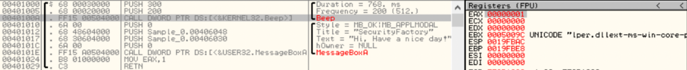

### 컴퓨터 구성
- 컴퓨터는 ```CPU, RAM(메인 메모리), 하드 디스크``` 가장 기본적이고 핵심적인 장치로 구성되어 있습니다.

<table>
<tr><th>용 어</th><th>설 명</th></tr>
<tr><td>CPU</td><td>'Central Processing Unit'의 약자로 중앙처리장치라고 합니다. 모든 데이터의 연산과 처리를 수행합니다.</td></tr>
<tr><td>RAM</td><td>주 기억장치란 현재 실행되고 있는 프로그램과 이 프로그램이 필요로 하는 데이터를 일시적으로 저장하는 장치입니다.</td></tr>
<tr><td>하드 디스크</td><td>하드 디스크는 필요한 자료를 저장하는 저장 공간의 역할을 합니다.</td></tr>
</table>

### 분석 환경
- VirtualBox Windows 10
- OllyDBG 110
- 동적 분석 도구로는 ```procexp, Filemonitor, tcpview```를 사용합니다.
- procexp는 프로세스 모니터링, Filemonitor는 파일 모니터링, tcpview는 네트워크 연결 상태를 확인할 수 있는 프로그램입니다.

### OllyDBG 단축키

<table>
<tr><th>단축키</th><th>설 명</th></tr>
<tr><td>F2</td><td>BreakPoint 설치, 해제</td></tr>
<tr><td>F7</td><td>하나의 명령어를 실행. Call 명령어 실행 시 해당 함수 내부로 들어간다.</td></tr>
<tr><td>F8</td><td>하나의 명령어를 실행. Call 명령어 실행 시 해당 함수 내부로 들어가지 않는다.</td></tr>
<tr><td>F9</td><td>실행(excute)</td></tr>
<tr><td>Ctrl+F2</td><td>디버깅을 처음부터 다시 시작 (재실행)</td></tr>
<tr><td>Ctrl+F7</td><td>Step Into 명령어를 반복 실행</td></tr>
<tr><td>Ctrl+F8</td><td>Step Over 명령어를 반복 실행</td></tr>
<tr><td>Ctrl+F9</td><td>해당 함수 내에서 RETN 명령어까지 한 번에 실행</td></tr>
<tr><td>Ctrl+G</td><td>원하는 주소로 이동</td></tr>
<tr><td>Ctrl+E</td><td>데이터 수정 화면 열기</td></tr>
<tr><td>Alt+E</td><td>로드 중인 모듈 리스트 확인</td></tr>
<tr><td>Alt+M</td><td>Memory Map 확인</td></tr>
<tr><td>Alt+C</td><td>실행 명령 위치로 돌아간다.</td></tr>
<tr><td>-</td><td>커서가 - 위치로 이동</td></tr>
<tr><td>+</td><td>커서가 + 위치로 이동</td></tr>
<tr><td>Enter</td><td>커서가 Call이나 JMP 명령어에 위치해 있으면 해당 주소로 따라가서 보여준다. (실행되는 것은 아님)</td></tr>
</table>

<br/>

# 무작정 분석
## 실행파일 동작 확인
**분석을 시작하기 전에 파일을 실행시켜보는 것이 좋습니다.**
- 분석 시작 전 파일 실행을 통해 분석의 목적과 방향을 설정할 수 있고, 분석에 필요한 다양한 정보들을 얻을 수 있습니다.
- 프로그램이 잘 열린다면 문제 없이 실행된다는 정보와 32 bits 에서 동작하는 실행 파일이고, Anti-VM 기법이 적용되어 있지 않다는 뜻입니다.
- ```Anti-VM 기법```이란 악성코드 분석 기법 중 하나로 가상환경에서의 악성코드 분석 기술을 우회하는 방식이다. 가상머신 환경을 구축함으로써 나타나는 특징을 탐색하여 악성코드가 수행할 플랫폼 가상 머신 환경인지 판단할 수 있다.

## 코드 분석_Level.1 | 흐름 파악
**'나무를 보지 말고 숲을 보라' 라는 말처럼 리버싱에서는 먼저 전체적인 흐름을 파악하고, 세부적인 분석에 들어가야합니다.**

```첫 번째 방법 !```
- 비프음과 메세지 박스가 출력되는 exe 실행 파일을 디버거에 올려 실행시킵니다.
- StartUp 코드는 빨리 넘기고 Main() 함수를 찾아야합니다.
- F8을 이용해 내려가다보면 비프음이 나는 Call 함수를 찾을 수 있습니다.
- F2로 BreakPoint를 걸어두고 F7로 함수 내부로 들어갑니다.
- 소리를 출력해주는 Beep() 함수와 메세지 박스를 출력해주는 MessageBoxA() 함수를 볼 수 있습니다.
messagebox().png)

## 코드 분석_Level.2 | API 호출 분석
- Windows 운영체제는 비프음을 내고, 메세지 박스를 출력하는 것과 같은 이벤트를 Win32 API로 전달받아서 처리합니다.
- Beep()와 MessageBoxA() 함수는 API입니다. 사용자 프로세스에서 발생하는 이벤트는 API 호출로 이루어집니다.
- 실제 분석에서는 큰 틀은 API를 중심으로 하고, 세세한 분석이 필요할 때 어셈블리 코드를 살핍니다.
- API의 갯수는 매우 많기 때문에 이런 API들이 가지는 정보들도 다양합니다. 모두 암기할 수 없기 때문에 ```Microsoft의 MSDN이라는 Win32 API 사전```을 참고할 수 있습니다.
- Main() 함수 내의 Beep() 함수를 실행하면 EAX 값이 1 올라갑니다.


## 코드 분석_Level.3 | 파고들기
- 실행 파일의 데이터는 마이크로소프트에서 정한 규칙에 맞게 기록되어 있습니다. 이를 ```PE File Format``` 이라고 합니다.
- PE File Format은 ```PE 파일이 어떻게 구성되어야 하는지에 대한 규칙```입니다.
- 파일을 실행시키기 위해 필요한 정보가 기록되어 있는 영역인 ```PE Header```와 파일이 동작하는데 필요한 코드가 기록되어 있는 영역인 ```.text Section```, 파일이 실행될 때 필요한 부가적인 정보가 기록되어 있는 영역인 ```.data Section```이 있습니다.
- PE 헤더는 실행 파일이 맞는지, 실행될 때 파일 데이터가 메모리의 어느 위치에 올라가야 하는 지와 같은 정보가 기록되어 있고, text 섹션에는 위의 Beep() 함수와 MessageBoxA() 함수 호출 코드가 기록되어 있습니다. 또한 MessageBoxA() API를 호출할 때 인자로 들어가는 문자열 정보는 data 섹션에 기록됩니다.
- 디버거에서 메모리 맵(Alt+M)을 보면 수많은 파일 데이터들이 로드되어 있습니다. 이를 ```동적 연결 라이브러리 또는 DLL 파일```이라고 합니다.
- DLL 파일은 exe 파일의 비서라고 생각할 수 있습니다. exe 파일이 모든 동작을 수행할 필요 없이 DLL에게 시키면 특정 행위가 발생하는데, 비서에게 요청하는 동작이 API 호출입니다.

## 코드구현_Level.4
```cpp
#include <windows.h>

int main() {
    Beep(0x200, 0x300);
    MessageBoxA(0, "Hi, Have a nice day!", "SecurityFactory", 0);
    
    return 1;
}
```


